# Data Model — ER Diagram & Relations Reference

> **Platform:** Azure Synapse Analytics (Serverless + Dedicated SQL Pool)
> **Architecture:** Medallion Lakehouse (Bronze / Silver / Gold)
> **Generated from migrations:** `001_bronze_tables.sql` → `005_gold_facts.sql`

---

## Table of Contents

1. [Overview — Medallion Layer Summary](#1-overview--medallion-layer-summary)
2. [Bronze Layer ER Diagram](#2-bronze-layer-er-diagram)
3. [Silver Layer ER Diagram](#3-silver-layer-er-diagram)
4. [Gold Layer ER Diagram](#4-gold-layer-er-diagram)
5. [Relationship Matrix (All FK Relationships)](#5-relationship-matrix--all-fk-relationships)
6. [Star Schema Diagrams](#6-star-schema-diagrams)
7. [SCD2 Tables — Mechanics & Usage](#7-scd2-tables--mechanics--usage)
8. [Data Lineage](#8-data-lineage)
9. [Distribution & Partitioning Strategy](#9-distribution--partitioning-strategy)
10. [Naming Conventions](#10-naming-conventions)

---

## 1. Overview — Medallion Layer Summary

| Layer      | Schema     | Engine                        | Table Count | Tables                                                                                                                                                                                  | Purpose                                                                                                                                                    |
|------------|------------|-------------------------------|-------------|-----------------------------------------------------------------------------------------------------------------------------------------------------------------------------------------|------------------------------------------------------------------------------------------------------------------------------------------------------------|
| **Bronze** | `dbo`      | Synapse Serverless SQL Pool   | 6           | `brz_transaction_logs`, `brz_auth_logs`, `brz_api_gateway_logs`, `brz_application_error_logs`, `brz_audit_logs`, `brz_fraud_alert_logs`                                                | Raw ingestion layer. External tables over ADLS Gen2 Delta/Parquet files. No transformations. Read-only projections of the landing zone.                    |
| **Silver** | `silver`   | Synapse Dedicated SQL Pool    | 14          | 8 dimensions (`slv_dim_*`) + 6 fact/event tables (`slv_transaction_logs`, `slv_auth_logs`, `slv_api_request_logs`, `slv_application_error_logs`, `slv_audit_logs`, `slv_fraud_alert_logs`) | Cleansed, deduplicated, and conformed layer. Dimension surrogate keys resolved. SCD2 history maintained on account and customer dimensions.                |
| **Gold**   | `gold`     | Synapse Dedicated SQL Pool    | 12          | 6 dimensions (`gld_dim_*`) + 3 event facts + 2 aggregates + `gld_anomaly_events` + `gld_log_classifications` + `gld_log_embeddings`                                                    | Presentation-ready layer for BI dashboards, operational reporting, anomaly detection outputs, and ML feature stores. AI/ML scoring columns included inline. |

**Silver dimension tables (8):**
`slv_dim_date`, `slv_dim_account` *(SCD2)*, `slv_dim_customer` *(SCD2)*, `slv_dim_channel`, `slv_dim_transaction_type`, `slv_dim_service`, `slv_dim_error_type`, `slv_dim_auth_event_type`

**Gold dimension tables (6):**
`gld_dim_date`, `gld_dim_account`, `gld_dim_customer`, `gld_dim_channel`, `gld_dim_transaction_type`, `gld_dim_service`

---

## 2. Bronze Layer ER Diagram

> Bronze tables are external read-only projections over raw Delta Lake files. There are **no enforced foreign-key relationships** between Bronze tables — each represents an independent source system feed. Columns shown are the full DDL columns from `001_bronze_tables.sql`.

```mermaid
erDiagram

    brz_transaction_logs {
        NVARCHAR transaction_id PK
        NVARCHAR correlation_id
        NVARCHAR session_id
        NVARCHAR account_id
        NVARCHAR customer_id
        NVARCHAR debit_account_id
        NVARCHAR credit_account_id
        NVARCHAR transaction_type
        NVARCHAR transaction_sub_type
        NVARCHAR channel
        CHAR currency_code
        DECIMAL amount
        DECIMAL fee_amount
        DECIMAL base_currency_amount
        DECIMAL exchange_rate
        NVARCHAR transaction_status
        NVARCHAR failure_reason
        NVARCHAR response_code
        DATETIME2 initiated_at
        DATETIME2 completed_at
        INT processing_duration_ms
        NVARCHAR ip_address
        NVARCHAR device_id
        NVARCHAR device_fingerprint
        NVARCHAR user_agent
        CHAR geo_country
        NVARCHAR geo_city
        FLOAT geo_latitude
        FLOAT geo_longitude
        NVARCHAR service_name
        NVARCHAR service_version
        NVARCHAR environment
        FLOAT risk_score_raw
        NVARCHAR risk_label_raw
        NVARCHAR anomaly_flag_raw
        NVARCHAR source_system
        INT record_version
        BIT is_deleted
        NVARCHAR batch_id
        NVARCHAR raw_payload
        DATE ingestion_date
    }

    brz_auth_logs {
        NVARCHAR auth_event_id PK
        NVARCHAR correlation_id
        NVARCHAR session_id
        NVARCHAR user_id
        NVARCHAR account_id
        NVARCHAR customer_id
        NVARCHAR service_principal_id
        NVARCHAR event_type
        NVARCHAR auth_method
        NVARCHAR mfa_method
        NVARCHAR auth_result
        NVARCHAR failure_reason
        NVARCHAR failure_code
        INT attempt_count
        BIT step_up_required
        NVARCHAR channel
        NVARCHAR application_name
        NVARCHAR ip_address
        NVARCHAR device_id
        NVARCHAR device_type
        NVARCHAR device_fingerprint
        NVARCHAR os_platform
        NVARCHAR browser
        NVARCHAR user_agent
        CHAR geo_country
        NVARCHAR geo_city
        FLOAT geo_latitude
        FLOAT geo_longitude
        BIT is_vpn
        BIT is_tor_exit_node
        DATETIME2 token_issued_at
        DATETIME2 token_expires_at
        DATETIME2 session_started_at
        DATETIME2 session_ended_at
        FLOAT risk_score_raw
        NVARCHAR risk_label_raw
        BIT is_impossible_travel
        CHAR previous_geo_country
        DATETIME2 event_timestamp
        NVARCHAR source_system
        INT record_version
        BIT is_deleted
        NVARCHAR batch_id
        NVARCHAR raw_payload
        DATE ingestion_date
    }

    brz_api_gateway_logs {
        NVARCHAR request_id PK
        NVARCHAR trace_id
        NVARCHAR span_id
        NVARCHAR correlation_id
        NVARCHAR session_id
        NVARCHAR api_name
        NVARCHAR api_version
        NVARCHAR operation_id
        NVARCHAR http_method
        NVARCHAR request_path
        NVARCHAR query_string
        NVARCHAR content_type
        INT request_size_bytes
        NVARCHAR consumer_id
        NVARCHAR consumer_type
        NVARCHAR subscription_key_id
        NVARCHAR user_id
        NVARCHAR customer_id
        NVARCHAR ip_address
        NVARCHAR forwarded_ip
        NVARCHAR user_agent
        CHAR geo_country
        SMALLINT http_status_code
        INT response_size_bytes
        INT backend_latency_ms
        INT gateway_latency_ms
        INT total_latency_ms
        BIT cache_hit
        NVARCHAR error_code
        NVARCHAR error_message
        NVARCHAR tls_version
        NVARCHAR auth_scheme
        NVARCHAR jwt_subject
        INT rate_limit_remaining
        DATETIME2 rate_limit_reset_at
        NVARCHAR backend_service
        NVARCHAR backend_pod
        NVARCHAR protocol
        NVARCHAR gateway_node_id
        NVARCHAR region
        DATETIME2 request_timestamp
        DATETIME2 response_timestamp
        NVARCHAR source_system
        NVARCHAR batch_id
        NVARCHAR raw_payload
        DATE ingestion_date
    }

    brz_application_error_logs {
        NVARCHAR error_event_id PK
        NVARCHAR trace_id
        NVARCHAR span_id
        NVARCHAR correlation_id
        NVARCHAR application_name
        NVARCHAR application_version
        NVARCHAR service_name
        NVARCHAR service_version
        NVARCHAR component
        NVARCHAR environment
        NVARCHAR host_name
        NVARCHAR container_id
        NVARCHAR pod_name
        NVARCHAR namespace
        NVARCHAR severity_level
        NVARCHAR error_type
        NVARCHAR error_category
        NVARCHAR error_code
        NVARCHAR error_message
        NVARCHAR exception_class
        NVARCHAR stack_trace
        NVARCHAR inner_exception
        NVARCHAR operation_name
        NVARCHAR user_id
        NVARCHAR customer_id
        NVARCHAR account_id
        NVARCHAR request_id
        NVARCHAR session_id
        NVARCHAR thread_name
        NVARCHAR method_name
        BIT is_user_facing
        NVARCHAR affected_transaction_id
        INT retry_count
        BIT is_resolved
        DATETIME2 resolved_at
        NVARCHAR raw_root_cause_hint
        NVARCHAR custom_dimensions
        DATETIME2 event_timestamp
        NVARCHAR source_system
        NVARCHAR log_stream
        NVARCHAR batch_id
        NVARCHAR raw_payload
        DATE ingestion_date
    }

    brz_audit_logs {
        NVARCHAR audit_event_id PK
        NVARCHAR correlation_id
        NVARCHAR session_id
        NVARCHAR actor_user_id
        NVARCHAR actor_type
        NVARCHAR actor_role
        NVARCHAR actor_department
        NVARCHAR actor_ip_address
        NVARCHAR actor_device_id
        NVARCHAR actor_user_agent
        NVARCHAR impersonator_id
        NVARCHAR action_type
        NVARCHAR action_category
        NVARCHAR action_description
        NVARCHAR action_result
        NVARCHAR resource_type
        NVARCHAR resource_id
        NVARCHAR resource_owner_id
        NVARCHAR resource_classification
        NVARCHAR old_value
        NVARCHAR new_value
        NVARCHAR change_summary
        NVARCHAR changed_fields
        NVARCHAR regulatory_flag
        NVARCHAR data_classification
        BIT is_pii_accessed
        BIT is_pci_accessed
        NVARCHAR application_name
        NVARCHAR service_name
        NVARCHAR service_version
        NVARCHAR environment
        DATETIME2 event_timestamp
        NVARCHAR source_system
        NVARCHAR batch_id
        NVARCHAR raw_payload
        DATE ingestion_date
    }

    brz_fraud_alert_logs {
        NVARCHAR alert_id PK
        NVARCHAR case_id
        NVARCHAR correlation_id
        NVARCHAR rule_id
        NVARCHAR model_id
        NVARCHAR transaction_id
        NVARCHAR account_id
        NVARCHAR customer_id
        NVARCHAR auth_event_id
        NVARCHAR alert_type
        NVARCHAR alert_category
        NVARCHAR alert_severity
        NVARCHAR detection_method
        NVARCHAR alert_status
        FLOAT fraud_score
        FLOAT anomaly_score
        FLOAT confidence
        NVARCHAR fraud_model_version
        NVARCHAR triggered_rules
        NVARCHAR contributing_features
        NVARCHAR analyst_id
        NVARCHAR investigation_notes
        NVARCHAR resolution
        NVARCHAR action_taken
        DATETIME2 action_timestamp
        DATETIME2 resolved_at
        DECIMAL at_risk_amount
        CHAR currency_code
        DECIMAL recovered_amount
        DATETIME2 alert_raised_at
        DATETIME2 alert_updated_at
        NVARCHAR source_system
        NVARCHAR batch_id
        NVARCHAR raw_payload
        DATE ingestion_date
    }
```



> **Note:** Bronze tables have no FK relationships. Cross-domain linkage is via shared natural keys (`transaction_id`, `account_id`, `customer_id`, `auth_event_id`, `correlation_id`). These are soft references only, not enforced constraints.

---

## 3. Silver Layer ER Diagram

> Silver dimensions are linked to Silver fact/event tables via surrogate keys (`_sk` columns). FK constraints are **not enforced** by the Dedicated SQL Pool engine; referential integrity is maintained by the ETL pipeline. SCD2 tables (`slv_dim_account`, `slv_dim_customer`) carry `effective_from`, `effective_to`, and `is_current` columns. Facts always join on `is_current = 1`.

```mermaid
erDiagram

    slv_dim_date {
        INT date_sk PK
        DATE full_date
        SMALLINT calendar_year
        TINYINT calendar_quarter
        TINYINT calendar_month_num
        NVARCHAR calendar_month_name
        CHAR calendar_month_abbr
        TINYINT calendar_week_num
        SMALLINT day_of_year
        TINYINT day_of_month
        TINYINT day_of_week_num
        NVARCHAR day_of_week_name
        CHAR day_of_week_abbr
        NVARCHAR quarter_label
        NVARCHAR year_month_label
        BIT is_weekday
        BIT is_weekend
        BIT is_public_holiday
        NVARCHAR public_holiday_name
        BIT is_last_day_of_month
        BIT is_last_day_of_quarter
        BIT is_last_day_of_year
        SMALLINT fiscal_year
        TINYINT fiscal_quarter
        TINYINT fiscal_month_num
        NVARCHAR fiscal_period_name
        INT days_from_today
        BIT is_current_day
        BIT is_current_month
        BIT is_current_quarter
        BIT is_current_year
        DATETIME2 created_at
        DATETIME2 updated_at
    }

    slv_dim_account {
        BIGINT account_sk PK
        NVARCHAR account_id
        NVARCHAR account_type
        NVARCHAR account_sub_type
        NVARCHAR product_code
        CHAR currency_code
        DECIMAL credit_limit
        DECIMAL overdraft_limit
        NVARCHAR branch_code
        NVARCHAR branch_name
        NVARCHAR region
        CHAR country_code
        NVARCHAR account_status
        NVARCHAR account_segment
        NVARCHAR risk_rating
        NVARCHAR aml_risk_category
        DATE opened_date
        DATE closed_date
        NVARCHAR primary_customer_id
        DATE effective_from
        DATE effective_to
        BIT is_current
        BINARY scd_hash
        DATETIME2 created_at
        DATETIME2 updated_at
        NVARCHAR source_system
        NVARCHAR batch_id
    }

    slv_dim_customer {
        BIGINT customer_sk PK
        NVARCHAR customer_id
        NVARCHAR customer_type
        NVARCHAR first_name
        NVARCHAR last_name
        NVARCHAR full_name
        DATE date_of_birth
        NVARCHAR gender
        CHAR nationality
        NVARCHAR tax_id_masked
        NVARCHAR email_domain
        NVARCHAR mobile_country_code
        NVARCHAR preferred_channel
        CHAR preferred_language
        CHAR address_country_code
        NVARCHAR address_region
        NVARCHAR address_city
        NVARCHAR address_postcode_prefix
        NVARCHAR kyc_status
        DATE kyc_verified_date
        NVARCHAR kyc_level
        NVARCHAR aml_risk_rating
        BIT pep_flag
        BIT sanctions_flag
        BIT adverse_media_flag
        NVARCHAR customer_segment
        NVARCHAR customer_sub_segment
        DECIMAL customer_tenure_years
        NVARCHAR onboarding_channel
        DATE onboarding_date
        FLOAT churn_risk_score
        DATE effective_from
        DATE effective_to
        BIT is_current
        BINARY scd_hash
        DATETIME2 created_at
        DATETIME2 updated_at
        NVARCHAR source_system
        NVARCHAR batch_id
    }

    slv_dim_channel {
        INT channel_sk PK
        NVARCHAR channel_code
        NVARCHAR channel_name
        NVARCHAR channel_category
        NVARCHAR channel_description
        NVARCHAR parent_channel_code
        BIT is_digital
        BIT is_self_service
        BIT is_real_time
        BIT is_active
        NVARCHAR supported_auth_methods
        TINYINT sort_order
        DATETIME2 created_at
        DATETIME2 updated_at
    }

    slv_dim_transaction_type {
        INT transaction_type_sk PK
        NVARCHAR transaction_type_code
        NVARCHAR transaction_type_name
        NVARCHAR transaction_category
        NVARCHAR transaction_sub_category
        NVARCHAR parent_type_code
        NVARCHAR reporting_group
        BIT is_reversible
        BIT requires_authorisation
        BIT is_fee_bearing
        BIT affects_balance
        NVARCHAR regulatory_category
        NVARCHAR reporting_threshold_ccy
        DECIMAL reporting_threshold_amt
        BIT is_active
        DATETIME2 created_at
        DATETIME2 updated_at
    }

    slv_dim_service {
        INT service_sk PK
        NVARCHAR service_name
        NVARCHAR service_code
        NVARCHAR service_version
        NVARCHAR service_description
        NVARCHAR service_owner_team
        NVARCHAR service_owner_email
        NVARCHAR service_domain
        NVARCHAR service_subdomain
        NVARCHAR service_tier
        NVARCHAR environment
        NVARCHAR hosting_platform
        NVARCHAR region
        NVARCHAR namespace
        NVARCHAR sla_tier
        INT rto_minutes
        INT rpo_minutes
        BIT is_active
        DATETIME2 created_at
        DATETIME2 updated_at
    }

    slv_dim_error_type {
        INT error_type_sk PK
        NVARCHAR error_type_code
        NVARCHAR error_type_name
        NVARCHAR error_category
        NVARCHAR error_subcategory
        NVARCHAR severity_default
        BIT is_retriable
        INT max_retry_count
        BIT expected_in_prod
        BIT requires_alerting
        NVARCHAR resolution_playbook_url
        NVARCHAR owning_team
        NVARCHAR ai_classification_label
        BIT is_active
        DATETIME2 created_at
        DATETIME2 updated_at
    }

    slv_dim_auth_event_type {
        INT auth_event_type_sk PK
        NVARCHAR event_type_code
        NVARCHAR event_type_name
        NVARCHAR event_category
        NVARCHAR event_subcategory
        NVARCHAR auth_method_group
        BIT mfa_required
        BIT risk_indicator_flag
        BIT regulatory_relevant
        BIT is_session_terminating
        BIT triggers_fraud_check
        BIT is_active
        DATETIME2 created_at
        DATETIME2 updated_at
    }

    slv_transaction_logs {
        BIGINT txn_log_sk PK
        NVARCHAR transaction_id
        NVARCHAR correlation_id
        NVARCHAR session_id
        BIGINT account_sk FK
        BIGINT customer_sk FK
        INT channel_sk FK
        INT transaction_type_sk FK
        INT service_sk FK
        INT event_date_sk FK
        NVARCHAR account_id
        NVARCHAR customer_id
        NVARCHAR debit_account_id
        NVARCHAR credit_account_id
        NVARCHAR transaction_type_code
        NVARCHAR channel_code
        CHAR currency_code
        DECIMAL amount
        DECIMAL fee_amount
        DECIMAL base_currency_amount
        DECIMAL exchange_rate
        NVARCHAR transaction_status
        NVARCHAR failure_reason
        NVARCHAR response_code
        BIT is_failed
        BIT is_reversed
        INT processing_duration_ms
        NVARCHAR ip_address
        NVARCHAR device_id
        CHAR geo_country
        NVARCHAR geo_city
        FLOAT risk_score
        NVARCHAR risk_label
        BIT anomaly_flag
        DATETIME2 initiated_at
        DATETIME2 completed_at
        DATE event_date
        DATE ingestion_date
        NVARCHAR pipeline_run_id
        NVARCHAR source_system
        DATETIME2 silver_loaded_at
        BIT is_current
        BINARY record_hash
    }

    slv_auth_logs {
        BIGINT auth_log_sk PK
        NVARCHAR auth_event_id
        NVARCHAR correlation_id
        NVARCHAR session_id
        BIGINT account_sk FK
        BIGINT customer_sk FK
        INT channel_sk FK
        INT auth_event_type_sk FK
        INT event_date_sk FK
        NVARCHAR user_id
        NVARCHAR account_id
        NVARCHAR customer_id
        NVARCHAR service_principal_id
        NVARCHAR event_type_code
        NVARCHAR channel_code
        NVARCHAR auth_method
        NVARCHAR mfa_method
        NVARCHAR auth_result
        NVARCHAR failure_reason
        NVARCHAR failure_code
        INT attempt_count
        BIT is_success
        BIT is_mfa_used
        NVARCHAR ip_address
        NVARCHAR device_id
        NVARCHAR device_type
        CHAR geo_country
        NVARCHAR geo_city
        BIT is_vpn
        BIT is_tor_exit_node
        BIT is_impossible_travel
        CHAR previous_geo_country
        DATETIME2 token_issued_at
        DATETIME2 token_expires_at
        DATETIME2 session_started_at
        DATETIME2 session_ended_at
        FLOAT risk_score
        NVARCHAR risk_label
        DATETIME2 event_timestamp
        DATE event_date
        DATE ingestion_date
        NVARCHAR pipeline_run_id
        NVARCHAR source_system
        DATETIME2 silver_loaded_at
        BINARY record_hash
    }

    slv_api_request_logs {
        BIGINT api_log_sk PK
        NVARCHAR request_id
        NVARCHAR trace_id
        NVARCHAR span_id
        NVARCHAR correlation_id
        INT service_sk FK
        INT channel_sk FK
        INT event_date_sk FK
        NVARCHAR api_name
        NVARCHAR api_version
        NVARCHAR operation_id
        NVARCHAR http_method
        NVARCHAR request_path
        NVARCHAR consumer_id
        NVARCHAR user_id
        NVARCHAR customer_id
        SMALLINT http_status_code
        NVARCHAR http_status_class
        BIT is_error
        BIT is_client_error
        BIT is_server_error
        NVARCHAR error_code
        NVARCHAR error_message
        INT total_latency_ms
        INT gateway_latency_ms
        INT backend_latency_ms
        INT request_size_bytes
        INT response_size_bytes
        BIT cache_hit
        NVARCHAR ip_address
        CHAR geo_country
        NVARCHAR tls_version
        NVARCHAR auth_scheme
        NVARCHAR gateway_node_id
        NVARCHAR region
        DATETIME2 request_timestamp
        DATETIME2 response_timestamp
        DATE event_date
        DATE ingestion_date
        NVARCHAR pipeline_run_id
        NVARCHAR source_system
        DATETIME2 silver_loaded_at
        BINARY record_hash
    }

    slv_application_error_logs {
        BIGINT error_log_sk PK
        NVARCHAR error_event_id
        NVARCHAR trace_id
        NVARCHAR span_id
        NVARCHAR correlation_id
        INT service_sk FK
        INT error_type_sk FK
        INT event_date_sk FK
        NVARCHAR service_name
        NVARCHAR application_name
        NVARCHAR error_type_code
        NVARCHAR error_category
        NVARCHAR severity_level
        NVARCHAR error_code
        NVARCHAR error_message
        NVARCHAR exception_class
        NVARCHAR component
        NVARCHAR operation_name
        NVARCHAR host_name
        NVARCHAR pod_name
        NVARCHAR environment
        NVARCHAR user_id
        NVARCHAR customer_id
        NVARCHAR account_id
        NVARCHAR request_id
        NVARCHAR session_id
        NVARCHAR affected_transaction_id
        BIT is_user_facing
        BIT is_critical
        INT retry_count
        BIT is_resolved
        DATETIME2 resolved_at
        INT mean_time_to_resolve_mins
        NVARCHAR ai_root_cause_hint
        NVARCHAR ai_error_cluster_id
        DATETIME2 error_timestamp
        DATE event_date
        DATE ingestion_date
        NVARCHAR pipeline_run_id
        NVARCHAR source_system
        DATETIME2 silver_loaded_at
        BINARY record_hash
    }

    slv_audit_logs {
        BIGINT audit_log_sk PK
        NVARCHAR audit_event_id
        NVARCHAR correlation_id
        NVARCHAR session_id
        INT service_sk FK
        INT event_date_sk FK
        NVARCHAR actor_user_id
        NVARCHAR actor_type
        NVARCHAR actor_role
        NVARCHAR actor_department
        NVARCHAR actor_ip_address
        NVARCHAR impersonator_id
        NVARCHAR action_type
        NVARCHAR action_category
        NVARCHAR action_result
        BIT is_success
        BIT is_pii_accessed
        BIT is_pci_accessed
        NVARCHAR resource_type
        NVARCHAR resource_id
        NVARCHAR resource_owner_id
        NVARCHAR resource_classification
        NVARCHAR regulatory_flag
        NVARCHAR data_classification
        NVARCHAR regulatory_scope
        NVARCHAR changed_fields
        NVARCHAR change_summary
        NVARCHAR application_name
        NVARCHAR service_name
        NVARCHAR environment
        DATETIME2 event_timestamp
        DATE event_date
        DATE ingestion_date
        NVARCHAR pipeline_run_id
        NVARCHAR source_system
        DATETIME2 silver_loaded_at
        BINARY record_hash
    }

    slv_fraud_alert_logs {
        BIGINT fraud_alert_log_sk PK
        NVARCHAR alert_id
        NVARCHAR case_id
        NVARCHAR correlation_id
        BIGINT account_sk FK
        BIGINT customer_sk FK
        INT event_date_sk FK
        NVARCHAR account_id
        NVARCHAR customer_id
        NVARCHAR transaction_id
        NVARCHAR auth_event_id
        NVARCHAR rule_id
        NVARCHAR model_id
        NVARCHAR alert_type
        NVARCHAR alert_category
        NVARCHAR alert_severity
        NVARCHAR detection_method
        NVARCHAR alert_status
        FLOAT fraud_score
        FLOAT anomaly_score
        FLOAT confidence
        NVARCHAR fraud_model_version
        NVARCHAR resolution
        NVARCHAR action_taken
        NVARCHAR reviewed_by
        BIT is_confirmed_fraud
        BIT is_false_positive
        DECIMAL at_risk_amount
        CHAR currency_code
        DECIMAL recovered_amount
        DATETIME2 alert_raised_at
        DATETIME2 alert_resolved_at
        DATETIME2 action_timestamp
        DATE event_date
        DATE ingestion_date
        NVARCHAR pipeline_run_id
        NVARCHAR source_system
        DATETIME2 silver_loaded_at
        BINARY record_hash
    }

    %% Dimension → Fact relationships (many facts per dimension row)

    slv_dim_date        ||--o{ slv_transaction_logs      : "event_date_sk"
    slv_dim_date        ||--o{ slv_auth_logs              : "event_date_sk"
    slv_dim_date        ||--o{ slv_api_request_logs       : "event_date_sk"
    slv_dim_date        ||--o{ slv_application_error_logs : "event_date_sk"
    slv_dim_date        ||--o{ slv_audit_logs             : "event_date_sk"
    slv_dim_date        ||--o{ slv_fraud_alert_logs       : "event_date_sk"

    slv_dim_account     ||--o{ slv_transaction_logs       : "account_sk"
    slv_dim_account     ||--o{ slv_auth_logs              : "account_sk"
    slv_dim_account     ||--o{ slv_fraud_alert_logs       : "account_sk"

    slv_dim_customer    ||--o{ slv_transaction_logs       : "customer_sk"
    slv_dim_customer    ||--o{ slv_auth_logs              : "customer_sk"
    slv_dim_customer    ||--o{ slv_fraud_alert_logs       : "customer_sk"

    slv_dim_channel     ||--o{ slv_transaction_logs       : "channel_sk"
    slv_dim_channel     ||--o{ slv_auth_logs              : "channel_sk"
    slv_dim_channel     ||--o{ slv_api_request_logs       : "channel_sk"

    slv_dim_transaction_type ||--o{ slv_transaction_logs  : "transaction_type_sk"

    slv_dim_service     ||--o{ slv_transaction_logs       : "service_sk"
    slv_dim_service     ||--o{ slv_api_request_logs       : "service_sk"
    slv_dim_service     ||--o{ slv_application_error_logs : "service_sk"
    slv_dim_service     ||--o{ slv_audit_logs             : "service_sk"

    slv_dim_error_type  ||--o{ slv_application_error_logs : "error_type_sk"

    slv_dim_auth_event_type ||--o{ slv_auth_logs          : "auth_event_type_sk"
```



---

## 4. Gold Layer ER Diagram

> Gold dimensions are current-snapshot (no SCD2 history columns). Gold facts carry the same `_sk` FK pattern as Silver. `gld_anomaly_events`, `gld_log_classifications`, and `gld_log_embeddings` link back to fact tables via `source_fact_sk` + `source_domain` (logical FK — not a typed column reference to a single table).

```mermaid
erDiagram

    gld_dim_date {
        INT date_sk PK
        DATE full_date
        SMALLINT calendar_year
        TINYINT calendar_quarter
        TINYINT calendar_month_num
        NVARCHAR calendar_month_name
        CHAR calendar_month_abbr
        TINYINT calendar_week_num
        SMALLINT day_of_year
        TINYINT day_of_month
        TINYINT day_of_week_num
        NVARCHAR day_of_week_name
        CHAR day_of_week_abbr
        NVARCHAR quarter_label
        NVARCHAR year_month_label
        BIT is_weekday
        BIT is_weekend
        BIT is_public_holiday
        NVARCHAR public_holiday_name
        BIT is_last_day_of_month
        BIT is_last_day_of_quarter
        BIT is_last_day_of_year
        SMALLINT fiscal_year
        TINYINT fiscal_quarter
        TINYINT fiscal_month_num
        NVARCHAR fiscal_period_name
        INT days_from_today
        BIT is_current_day
        BIT is_current_month
        BIT is_current_quarter
        BIT is_current_year
        DATETIME2 gold_loaded_at
        DATETIME2 updated_at
    }

    gld_dim_account {
        BIGINT account_sk PK
        NVARCHAR account_id
        NVARCHAR account_type
        NVARCHAR account_sub_type
        NVARCHAR product_code
        CHAR currency_code
        DECIMAL credit_limit
        DECIMAL overdraft_limit
        NVARCHAR branch_code
        NVARCHAR branch_name
        NVARCHAR region
        CHAR country_code
        NVARCHAR account_status
        NVARCHAR account_segment
        NVARCHAR risk_rating
        NVARCHAR aml_risk_category
        DATE opened_date
        INT account_age_days
        NVARCHAR primary_customer_id
        BIGINT silver_account_sk
        DATE silver_effective_from
        NVARCHAR source_system
        DATETIME2 gold_loaded_at
        DATETIME2 updated_at
    }

    gld_dim_customer {
        BIGINT customer_sk PK
        NVARCHAR customer_id
        NVARCHAR customer_type
        NVARCHAR full_name
        NVARCHAR age_band
        NVARCHAR gender
        CHAR nationality
        NVARCHAR email_domain
        NVARCHAR mobile_country_code
        NVARCHAR preferred_channel
        CHAR preferred_language
        CHAR address_country_code
        NVARCHAR address_region
        NVARCHAR address_city
        NVARCHAR kyc_status
        NVARCHAR kyc_level
        NVARCHAR aml_risk_rating
        BIT pep_flag
        BIT sanctions_flag
        BIT adverse_media_flag
        NVARCHAR customer_segment
        NVARCHAR customer_sub_segment
        DECIMAL customer_tenure_years
        NVARCHAR onboarding_channel
        DATE onboarding_date
        FLOAT churn_risk_score
        NVARCHAR churn_risk_band
        BIGINT silver_customer_sk
        DATE silver_effective_from
        NVARCHAR source_system
        DATETIME2 gold_loaded_at
        DATETIME2 updated_at
    }

    gld_dim_channel {
        INT channel_sk PK
        NVARCHAR channel_code
        NVARCHAR channel_name
        NVARCHAR channel_category
        NVARCHAR channel_description
        NVARCHAR parent_channel_code
        BIT is_digital
        BIT is_self_service
        BIT is_real_time
        BIT is_active
        NVARCHAR supported_auth_methods
        TINYINT sort_order
        INT silver_channel_sk
        DATETIME2 gold_loaded_at
        DATETIME2 updated_at
    }

    gld_dim_transaction_type {
        INT transaction_type_sk PK
        NVARCHAR transaction_type_code
        NVARCHAR transaction_type_name
        NVARCHAR transaction_category
        NVARCHAR transaction_sub_category
        NVARCHAR parent_type_code
        NVARCHAR reporting_group
        BIT is_reversible
        BIT requires_authorisation
        BIT is_fee_bearing
        BIT affects_balance
        NVARCHAR regulatory_category
        NVARCHAR reporting_threshold_ccy
        DECIMAL reporting_threshold_amt
        BIT is_active
        INT silver_txn_type_sk
        DATETIME2 gold_loaded_at
        DATETIME2 updated_at
    }

    gld_dim_service {
        INT service_sk PK
        NVARCHAR service_name
        NVARCHAR service_code
        NVARCHAR service_version
        NVARCHAR service_description
        NVARCHAR service_owner_team
        NVARCHAR service_domain
        NVARCHAR service_subdomain
        NVARCHAR service_tier
        NVARCHAR environment
        NVARCHAR hosting_platform
        NVARCHAR region
        NVARCHAR namespace
        NVARCHAR sla_tier
        INT rto_minutes
        INT rpo_minutes
        BIT is_active
        INT silver_service_sk
        DATETIME2 gold_loaded_at
        DATETIME2 updated_at
    }

    gld_fact_transaction_logs {
        BIGINT txn_fact_sk PK
        NVARCHAR transaction_id
        NVARCHAR correlation_id
        BIGINT account_sk FK
        BIGINT customer_sk FK
        INT channel_sk FK
        INT transaction_type_sk FK
        INT service_sk FK
        INT event_date_sk FK
        NVARCHAR account_id
        NVARCHAR customer_id
        NVARCHAR transaction_type_code
        NVARCHAR channel_code
        CHAR currency_code
        DECIMAL amount
        DECIMAL fee_amount
        DECIMAL base_currency_amount
        DECIMAL exchange_rate
        NVARCHAR transaction_status
        BIT is_completed
        BIT is_failed
        BIT is_reversed
        NVARCHAR failure_reason
        NVARCHAR response_code
        INT processing_duration_ms
        CHAR geo_country
        NVARCHAR geo_city
        BIT is_anomaly
        FLOAT anomaly_score
        NVARCHAR ai_risk_label
        BIT ai_fraud_indicator
        FLOAT ai_fraud_score
        NVARCHAR ai_model_id
        DATETIME2 ai_scored_at
        DATETIME2 initiated_at
        DATETIME2 completed_at
        DATE event_date
        BIGINT silver_txn_log_sk
        DATE ingestion_date
        NVARCHAR pipeline_run_id
        DATETIME2 gold_loaded_at
    }

    gld_fact_auth_events {
        BIGINT auth_fact_sk PK
        NVARCHAR auth_event_id
        NVARCHAR correlation_id
        NVARCHAR session_id
        BIGINT account_sk FK
        BIGINT customer_sk FK
        INT channel_sk FK
        INT event_date_sk FK
        NVARCHAR user_id
        NVARCHAR account_id
        NVARCHAR customer_id
        NVARCHAR event_type_code
        NVARCHAR channel_code
        NVARCHAR auth_method
        NVARCHAR mfa_method
        NVARCHAR auth_result
        BIT is_success
        BIT is_mfa_used
        BIT is_step_up
        INT attempt_count
        NVARCHAR failure_code
        NVARCHAR ip_address
        NVARCHAR device_id
        NVARCHAR device_type
        CHAR geo_country
        NVARCHAR geo_city
        BIT is_vpn
        BIT is_tor_exit_node
        INT session_duration_seconds
        BIT is_anomaly
        FLOAT anomaly_score
        FLOAT ai_account_takeover_score
        BIT ai_impossible_travel_flag
        NVARCHAR ai_risk_label
        NVARCHAR ai_model_id
        DATETIME2 ai_scored_at
        DATETIME2 event_timestamp
        DATE event_date
        BIGINT silver_auth_log_sk
        DATE ingestion_date
        NVARCHAR pipeline_run_id
        DATETIME2 gold_loaded_at
    }

    gld_fact_application_errors {
        BIGINT error_fact_sk PK
        NVARCHAR error_event_id
        NVARCHAR trace_id
        NVARCHAR correlation_id
        INT service_sk FK
        INT event_date_sk FK
        NVARCHAR service_name
        NVARCHAR application_name
        NVARCHAR error_type_code
        NVARCHAR error_category
        NVARCHAR severity_level
        NVARCHAR environment
        NVARCHAR component
        NVARCHAR operation_name
        NVARCHAR host_name
        NVARCHAR pod_name
        NVARCHAR user_id
        NVARCHAR customer_id
        NVARCHAR account_id
        NVARCHAR request_id
        NVARCHAR affected_transaction_id
        BIT is_user_facing
        BIT is_critical
        INT retry_count
        BIT is_resolved
        INT mean_time_to_resolve_mins
        NVARCHAR error_code
        NVARCHAR error_message
        NVARCHAR ai_root_cause_hint
        NVARCHAR ai_error_cluster_id
        NVARCHAR ai_resolution_hint
        NVARCHAR ai_severity_prediction
        NVARCHAR ai_model_id
        DATETIME2 ai_scored_at
        DATETIME2 error_timestamp
        DATETIME2 resolved_at
        DATE event_date
        BIGINT silver_error_log_sk
        DATE ingestion_date
        NVARCHAR pipeline_run_id
        DATETIME2 gold_loaded_at
    }

    gld_agg_txn_hourly {
        BIGINT account_sk FK
        INT channel_sk FK
        INT transaction_type_sk FK
        INT event_date_sk FK
        TINYINT event_hour
        NVARCHAR account_id
        NVARCHAR channel_code
        NVARCHAR transaction_type_code
        CHAR currency_code
        INT txn_count
        INT txn_count_completed
        INT txn_count_failed
        INT txn_count_reversed
        DECIMAL total_amount
        DECIMAL total_base_currency_amount
        DECIMAL avg_amount
        DECIMAL min_amount
        DECIMAL max_amount
        DECIMAL total_fee_amount
        FLOAT avg_processing_duration_ms
        INT max_processing_duration_ms
        INT anomaly_count
        FLOAT avg_anomaly_score
        FLOAT max_anomaly_score
        INT high_risk_count
        DECIMAL failure_rate_pct
        NVARCHAR pipeline_run_id
        DATETIME2 gold_loaded_at
    }

    gld_agg_auth_daily {
        BIGINT customer_sk FK
        INT channel_sk FK
        INT event_date_sk FK
        NVARCHAR event_type_code
        NVARCHAR auth_result
        NVARCHAR customer_id
        NVARCHAR channel_code
        INT event_count
        INT success_count
        INT failure_count
        INT lockout_count
        INT mfa_used_count
        INT anomaly_count
        FLOAT avg_anomaly_score
        FLOAT max_anomaly_score
        FLOAT ato_score_max
        INT impossible_travel_count
        INT vpn_event_count
        DECIMAL failure_rate_pct
        DATE event_date
        NVARCHAR pipeline_run_id
        DATETIME2 gold_loaded_at
    }

    gld_anomaly_events {
        BIGINT anomaly_event_sk PK
        NVARCHAR source_domain
        BIGINT source_fact_sk
        NVARCHAR source_event_id
        BIGINT account_sk FK
        BIGINT customer_sk FK
        INT service_sk FK
        INT event_date_sk FK
        NVARCHAR account_id
        NVARCHAR customer_id
        NVARCHAR anomaly_type
        NVARCHAR anomaly_category
        NVARCHAR severity
        FLOAT anomaly_score
        FLOAT confidence
        NVARCHAR contributing_signals
        NVARCHAR feature_values
        NVARCHAR detection_model_id
        NVARCHAR detection_model_version
        NVARCHAR alert_id
        NVARCHAR case_id
        BIT is_escalated
        NVARCHAR escalated_to
        DATETIME2 escalated_at
        BIT is_resolved
        NVARCHAR resolution_label
        DATETIME2 resolved_at
        NVARCHAR resolved_by
        DATETIME2 detected_at
        DATE event_date
        NVARCHAR pipeline_run_id
        DATETIME2 gold_loaded_at
    }

    gld_log_classifications {
        BIGINT classification_sk PK
        NVARCHAR source_domain
        NVARCHAR source_event_id
        BIGINT source_fact_sk
        NVARCHAR primary_label
        NVARCHAR secondary_label
        NVARCHAR tertiary_label
        FLOAT label_confidence
        NVARCHAR all_labels
        NVARCHAR intent_category
        NVARCHAR intent_sub_category
        NVARCHAR topic_cluster_id
        NVARCHAR sentiment_label
        FLOAT sentiment_score
        BIT is_pii_detected
        BIT is_sensitive_content
        FLOAT data_sensitivity_score
        NVARCHAR model_id
        NVARCHAR model_version
        NVARCHAR prompt_template_id
        DATETIME2 classified_at
        NVARCHAR pipeline_run_id
        DATETIME2 gold_loaded_at
    }

    gld_log_embeddings {
        BIGINT embedding_sk PK
        NVARCHAR source_domain
        NVARCHAR source_event_id
        BIGINT source_fact_sk
        NVARCHAR embedding_model_id
        NVARCHAR embedding_model_version
        INT embedding_dimensions
        NVARCHAR input_text_preview
        INT input_text_tokens
        NVARCHAR embedding_vector
        FLOAT embedding_norm
        NVARCHAR topic_cluster_id
        NVARCHAR topic_cluster_label
        FLOAT nearest_anomaly_distance
        DATETIME2 valid_from
        DATETIME2 valid_to
        BIT is_current
        DATETIME2 embedded_at
        NVARCHAR pipeline_run_id
        DATETIME2 gold_loaded_at
    }

    %% Dimension → Fact relationships

    gld_dim_date            ||--o{ gld_fact_transaction_logs   : "event_date_sk"
    gld_dim_date            ||--o{ gld_fact_auth_events        : "event_date_sk"
    gld_dim_date            ||--o{ gld_fact_application_errors : "event_date_sk"
    gld_dim_date            ||--o{ gld_agg_txn_hourly          : "event_date_sk"
    gld_dim_date            ||--o{ gld_agg_auth_daily          : "event_date_sk"
    gld_dim_date            ||--o{ gld_anomaly_events          : "event_date_sk"

    gld_dim_account         ||--o{ gld_fact_transaction_logs   : "account_sk"
    gld_dim_account         ||--o{ gld_fact_auth_events        : "account_sk"
    gld_dim_account         ||--o{ gld_agg_txn_hourly          : "account_sk"
    gld_dim_account         ||--o{ gld_anomaly_events          : "account_sk"

    gld_dim_customer        ||--o{ gld_fact_transaction_logs   : "customer_sk"
    gld_dim_customer        ||--o{ gld_fact_auth_events        : "customer_sk"
    gld_dim_customer        ||--o{ gld_agg_auth_daily          : "customer_sk"
    gld_dim_customer        ||--o{ gld_anomaly_events          : "customer_sk"

    gld_dim_channel         ||--o{ gld_fact_transaction_logs   : "channel_sk"
    gld_dim_channel         ||--o{ gld_fact_auth_events        : "channel_sk"
    gld_dim_channel         ||--o{ gld_agg_txn_hourly          : "channel_sk"
    gld_dim_channel         ||--o{ gld_agg_auth_daily          : "channel_sk"

    gld_dim_transaction_type ||--o{ gld_fact_transaction_logs  : "transaction_type_sk"
    gld_dim_transaction_type ||--o{ gld_agg_txn_hourly         : "transaction_type_sk"

    gld_dim_service         ||--o{ gld_fact_transaction_logs   : "service_sk"
    gld_dim_service         ||--o{ gld_fact_application_errors : "service_sk"
    gld_dim_service         ||--o{ gld_anomaly_events          : "service_sk"

    %% Cross-domain AI tables (logical FK via source_domain + source_fact_sk)
    gld_fact_transaction_logs   ||--o{ gld_anomaly_events       : "source_fact_sk (TRANSACTION)"
    gld_fact_auth_events        ||--o{ gld_anomaly_events       : "source_fact_sk (AUTH)"
    gld_fact_application_errors ||--o{ gld_anomaly_events       : "source_fact_sk (ERROR)"

    gld_fact_transaction_logs   ||--o{ gld_log_classifications  : "source_fact_sk (TRANSACTION)"
    gld_fact_auth_events        ||--o{ gld_log_classifications  : "source_fact_sk (AUTH)"
    gld_fact_application_errors ||--o{ gld_log_classifications  : "source_fact_sk (ERROR)"

    gld_fact_transaction_logs   ||--o{ gld_log_embeddings       : "source_fact_sk (TRANSACTION)"
    gld_fact_auth_events        ||--o{ gld_log_embeddings       : "source_fact_sk (AUTH)"
    gld_fact_application_errors ||--o{ gld_log_embeddings       : "source_fact_sk (ERROR)"
```



---

## 5. Relationship Matrix — All FK Relationships

> Constraints are **logically defined** but not enforced by the engine (Synapse Dedicated Pool does not support enforced FK constraints). Referential integrity is maintained by the ETL pipeline.

### Silver Layer FK Relationships

| Source Table                   | Source Column        | Target Table                 | Target Column | Cardinality | Notes                                              |
|--------------------------------|----------------------|------------------------------|---------------|-------------|----------------------------------------------------|
| `slv_transaction_logs`         | `account_sk`         | `slv_dim_account`            | `account_sk`  | Many-to-one | Join on `is_current = 1` when using SCD2 history   |
| `slv_transaction_logs`         | `customer_sk`        | `slv_dim_customer`           | `customer_sk` | Many-to-one | Nullable; join on `is_current = 1`                 |
| `slv_transaction_logs`         | `channel_sk`         | `slv_dim_channel`            | `channel_sk`  | Many-to-one | Nullable                                           |
| `slv_transaction_logs`         | `transaction_type_sk`| `slv_dim_transaction_type`   | `transaction_type_sk` | Many-to-one | Nullable                               |
| `slv_transaction_logs`         | `service_sk`         | `slv_dim_service`            | `service_sk`  | Many-to-one | Nullable                                           |
| `slv_transaction_logs`         | `event_date_sk`      | `slv_dim_date`               | `date_sk`     | Many-to-one | NOT NULL; YYYYMMDD integer key                     |
| `slv_auth_logs`                | `account_sk`         | `slv_dim_account`            | `account_sk`  | Many-to-one | Nullable (service-to-service auth has no account)  |
| `slv_auth_logs`                | `customer_sk`        | `slv_dim_customer`           | `customer_sk` | Many-to-one | Nullable                                           |
| `slv_auth_logs`                | `channel_sk`         | `slv_dim_channel`            | `channel_sk`  | Many-to-one | Nullable                                           |
| `slv_auth_logs`                | `auth_event_type_sk` | `slv_dim_auth_event_type`    | `auth_event_type_sk` | Many-to-one | Nullable                              |
| `slv_auth_logs`                | `event_date_sk`      | `slv_dim_date`               | `date_sk`     | Many-to-one | NOT NULL                                           |
| `slv_api_request_logs`         | `service_sk`         | `slv_dim_service`            | `service_sk`  | Many-to-one | Nullable; resolved from `backend_service`          |
| `slv_api_request_logs`         | `channel_sk`         | `slv_dim_channel`            | `channel_sk`  | Many-to-one | Nullable                                           |
| `slv_api_request_logs`         | `event_date_sk`      | `slv_dim_date`               | `date_sk`     | Many-to-one | NOT NULL                                           |
| `slv_application_error_logs`   | `service_sk`         | `slv_dim_service`            | `service_sk`  | Many-to-one | Nullable                                           |
| `slv_application_error_logs`   | `error_type_sk`      | `slv_dim_error_type`         | `error_type_sk` | Many-to-one | Nullable                                         |
| `slv_application_error_logs`   | `event_date_sk`      | `slv_dim_date`               | `date_sk`     | Many-to-one | NOT NULL                                           |
| `slv_audit_logs`               | `service_sk`         | `slv_dim_service`            | `service_sk`  | Many-to-one | Nullable                                           |
| `slv_audit_logs`               | `event_date_sk`      | `slv_dim_date`               | `date_sk`     | Many-to-one | NOT NULL                                           |
| `slv_fraud_alert_logs`         | `account_sk`         | `slv_dim_account`            | `account_sk`  | Many-to-one | Nullable                                           |
| `slv_fraud_alert_logs`         | `customer_sk`        | `slv_dim_customer`           | `customer_sk` | Many-to-one | Nullable                                           |
| `slv_fraud_alert_logs`         | `event_date_sk`      | `slv_dim_date`               | `date_sk`     | Many-to-one | NOT NULL                                           |

### Gold Layer FK Relationships — Dimension to Fact

| Source Table                   | Source Column         | Target Table                  | Target Column       | Cardinality | Notes                                                      |
|--------------------------------|-----------------------|-------------------------------|---------------------|-------------|------------------------------------------------------------|
| `gld_fact_transaction_logs`    | `account_sk`          | `gld_dim_account`             | `account_sk`        | Many-to-one | NOT NULL; distribution key                                 |
| `gld_fact_transaction_logs`    | `customer_sk`         | `gld_dim_customer`            | `customer_sk`       | Many-to-one | Nullable                                                   |
| `gld_fact_transaction_logs`    | `channel_sk`          | `gld_dim_channel`             | `channel_sk`        | Many-to-one | Nullable                                                   |
| `gld_fact_transaction_logs`    | `transaction_type_sk` | `gld_dim_transaction_type`    | `transaction_type_sk` | Many-to-one | Nullable                                                 |
| `gld_fact_transaction_logs`    | `service_sk`          | `gld_dim_service`             | `service_sk`        | Many-to-one | Nullable                                                   |
| `gld_fact_transaction_logs`    | `event_date_sk`       | `gld_dim_date`                | `date_sk`           | Many-to-one | NOT NULL                                                   |
| `gld_fact_auth_events`         | `account_sk`          | `gld_dim_account`             | `account_sk`        | Many-to-one | Nullable (service auth has no account)                     |
| `gld_fact_auth_events`         | `customer_sk`         | `gld_dim_customer`            | `customer_sk`       | Many-to-one | Nullable                                                   |
| `gld_fact_auth_events`         | `channel_sk`          | `gld_dim_channel`             | `channel_sk`        | Many-to-one | Nullable                                                   |
| `gld_fact_auth_events`         | `event_date_sk`       | `gld_dim_date`                | `date_sk`           | Many-to-one | NOT NULL                                                   |
| `gld_fact_application_errors`  | `service_sk`          | `gld_dim_service`             | `service_sk`        | Many-to-one | Nullable; distribution key                                 |
| `gld_fact_application_errors`  | `event_date_sk`       | `gld_dim_date`                | `date_sk`           | Many-to-one | NOT NULL                                                   |
| `gld_agg_txn_hourly`           | `account_sk`          | `gld_dim_account`             | `account_sk`        | Many-to-one | Composite grain key column                                 |
| `gld_agg_txn_hourly`           | `channel_sk`          | `gld_dim_channel`             | `channel_sk`        | Many-to-one | Composite grain key column                                 |
| `gld_agg_txn_hourly`           | `transaction_type_sk` | `gld_dim_transaction_type`    | `transaction_type_sk` | Many-to-one | Composite grain key column                               |
| `gld_agg_txn_hourly`           | `event_date_sk`       | `gld_dim_date`                | `date_sk`           | Many-to-one | Composite grain key column                                 |
| `gld_agg_auth_daily`           | `customer_sk`         | `gld_dim_customer`            | `customer_sk`       | Many-to-one | Composite grain key column; distribution key               |
| `gld_agg_auth_daily`           | `channel_sk`          | `gld_dim_channel`             | `channel_sk`        | Many-to-one | Composite grain key column                                 |
| `gld_agg_auth_daily`           | `event_date_sk`       | `gld_dim_date`                | `date_sk`           | Many-to-one | Composite grain key column                                 |
| `gld_anomaly_events`           | `account_sk`          | `gld_dim_account`             | `account_sk`        | Many-to-one | Nullable; distribution key                                 |
| `gld_anomaly_events`           | `customer_sk`         | `gld_dim_customer`            | `customer_sk`       | Many-to-one | Nullable                                                   |
| `gld_anomaly_events`           | `service_sk`          | `gld_dim_service`             | `service_sk`        | Many-to-one | Nullable                                                   |
| `gld_anomaly_events`           | `event_date_sk`       | `gld_dim_date`                | `date_sk`           | Many-to-one | NOT NULL                                                   |

### Gold Layer FK Relationships — Cross-Domain (Logical, via `source_domain` + `source_fact_sk`)

| Source Table              | Source Columns                          | Target Table                   | Target Column   | Cardinality | Notes                                                                       |
|---------------------------|-----------------------------------------|--------------------------------|-----------------|-------------|-----------------------------------------------------------------------------|
| `gld_anomaly_events`      | `source_fact_sk` + `source_domain`      | `gld_fact_transaction_logs`    | `txn_fact_sk`   | Many-to-one | When `source_domain = 'TRANSACTION'`                                        |
| `gld_anomaly_events`      | `source_fact_sk` + `source_domain`      | `gld_fact_auth_events`         | `auth_fact_sk`  | Many-to-one | When `source_domain = 'AUTH'`                                               |
| `gld_anomaly_events`      | `source_fact_sk` + `source_domain`      | `gld_fact_application_errors`  | `error_fact_sk` | Many-to-one | When `source_domain = 'ERROR'`                                              |
| `gld_log_classifications` | `source_fact_sk` + `source_domain`      | `gld_fact_transaction_logs`    | `txn_fact_sk`   | Many-to-one | When `source_domain = 'TRANSACTION'`; also covers AUDIT, FRAUD domains      |
| `gld_log_classifications` | `source_fact_sk` + `source_domain`      | `gld_fact_auth_events`         | `auth_fact_sk`  | Many-to-one | When `source_domain = 'AUTH'`                                               |
| `gld_log_classifications` | `source_fact_sk` + `source_domain`      | `gld_fact_application_errors`  | `error_fact_sk` | Many-to-one | When `source_domain = 'ERROR'`                                              |
| `gld_log_embeddings`      | `source_fact_sk` + `source_domain`      | `gld_fact_transaction_logs`    | `txn_fact_sk`   | Many-to-one | When `source_domain = 'TRANSACTION'`; also covers AUDIT, FRAUD domains      |
| `gld_log_embeddings`      | `source_fact_sk` + `source_domain`      | `gld_fact_auth_events`         | `auth_fact_sk`  | Many-to-one | When `source_domain = 'AUTH'`                                               |
| `gld_log_embeddings`      | `source_fact_sk` + `source_domain`      | `gld_fact_application_errors`  | `error_fact_sk` | Many-to-one | When `source_domain = 'ERROR'`                                              |

### Gold Lineage Columns (Silver → Gold Traceability)

| Gold Table                     | Lineage Column          | Points To                              |
|--------------------------------|-------------------------|----------------------------------------|
| `gld_fact_transaction_logs`    | `silver_txn_log_sk`     | `silver.slv_transaction_logs.txn_log_sk` |
| `gld_fact_auth_events`         | `silver_auth_log_sk`    | `silver.slv_auth_logs.auth_log_sk`     |
| `gld_fact_application_errors`  | `silver_error_log_sk`   | `silver.slv_application_error_logs.error_log_sk` |
| `gld_dim_account`              | `silver_account_sk`     | `silver.slv_dim_account.account_sk`    |
| `gld_dim_customer`             | `silver_customer_sk`    | `silver.slv_dim_customer.customer_sk`  |
| `gld_dim_channel`              | `silver_channel_sk`     | `silver.slv_dim_channel.channel_sk`    |
| `gld_dim_transaction_type`     | `silver_txn_type_sk`    | `silver.slv_dim_transaction_type.transaction_type_sk` |
| `gld_dim_service`              | `silver_service_sk`     | `silver.slv_dim_service.service_sk`    |

---

## 6. Star Schema Diagrams

### 6.1 Transaction Analytics Mart

```
                         gld_dim_date
                        (date_sk PK)
                             |
                             | event_date_sk
                             |
gld_dim_channel -------+-----+-----+------- gld_dim_account
(channel_sk PK)        |           |        (account_sk PK)
        channel_sk     |           | account_sk
                       |           |
gld_dim_transaction_type--+   gld_fact_transaction_logs   +-- gld_dim_customer
(transaction_type_sk PK)  |   (txn_fact_sk PK)            |   (customer_sk PK)
       transaction_type_sk+   +-----------------------+   + customer_sk
                              | transaction_id        |
                              | account_sk (FK)       |
                              | customer_sk (FK)      |+-- gld_dim_service
                              | channel_sk (FK)       |    (service_sk PK)
                              | transaction_type_sk(FK)|     service_sk
                              | service_sk (FK)       |
                              | event_date_sk (FK)    |
                              | amount                |
                              | fee_amount            |
                              | base_currency_amount  |
                              | processing_duration_ms|
                              | is_completed          |
                              | is_failed             |
                              | is_reversed           |
                              | is_anomaly            |
                              | anomaly_score         |
                              | ai_fraud_score        |
                              | ai_risk_label         |
                              +-----------------------+
                                         |
                                         | (pre-aggregated)
                                         v
                              gld_agg_txn_hourly
                              (account_sk + channel_sk +
                               transaction_type_sk +
                               event_date_sk + event_hour)
```

### 6.2 Auth / Security Mart

```
               gld_dim_date
              (date_sk PK)
                   |
                   | event_date_sk
                   |
gld_dim_channel----+----------- gld_fact_auth_events ----------- gld_dim_account
(channel_sk PK)    |            (auth_fact_sk PK)                (account_sk PK)
    channel_sk     |            +------------------------------+
                   |            | auth_event_id                |
                   |            | account_sk (FK)              |
                   |            | customer_sk (FK)             |+-- gld_dim_customer
                   |            | channel_sk (FK)              |    (customer_sk PK)
                   |            | event_date_sk (FK)           |
                   |            | auth_method                  |
                   |            | mfa_method                   |
                   |            | auth_result                  |
                   |            | is_success                   |
                   |            | is_mfa_used                  |
                   |            | attempt_count                |
                   |            | is_vpn                       |
                   |            | is_tor_exit_node             |
                   |            | session_duration_seconds     |
                   |            | is_anomaly                   |
                   |            | ai_account_takeover_score    |
                   |            | ai_impossible_travel_flag    |
                   |            | ai_risk_label                |
                   |            +------------------------------+
                   |                         |
                   |                         | (pre-aggregated)
                   |                         v
                   |              gld_agg_auth_daily
                   |              (customer_sk + channel_sk +
                   +-------------- event_date_sk + event_type_code
                                   + auth_result)
```

### 6.3 Application Health Mart

```
                    gld_dim_date
                   (date_sk PK)
                        |
                        | event_date_sk
                        |
gld_dim_service --------+------ gld_fact_application_errors
(service_sk PK)         |       (error_fact_sk PK)
     service_sk         |       +----------------------------------+
                        |       | error_event_id                   |
                        |       | service_sk (FK)                  |
                        |       | event_date_sk (FK)               |
                        |       | application_name                 |
                        |       | error_type_code                  |
                        |       | error_category                   |
                        |       | severity_level                   |
                        |       | environment                      |
                        |       | component                        |
                        |       | host_name / pod_name             |
                        |       | is_user_facing                   |
                        |       | is_critical                      |
                        |       | retry_count                      |
                        |       | mean_time_to_resolve_mins        |
                        |       | ai_root_cause_hint               |
                        |       | ai_error_cluster_id              |
                        |       | ai_resolution_hint               |
                        |       | ai_severity_prediction           |
                        |       +----------------------------------+
                        |                     |
                        |                     | source_fact_sk (source_domain='ERROR')
                        |                     v
                        |           gld_anomaly_events
                        |           gld_log_classifications
                        |           gld_log_embeddings
                        +----(service_sk)----^
```

---

## 7. SCD2 Tables — Mechanics & Usage

### Tables with SCD Type 2

| Table               | Layer  | Distribution         | SCD Type |
|---------------------|--------|----------------------|----------|
| `slv_dim_account`   | Silver | `HASH(account_id)`   | Type 2   |
| `slv_dim_customer`  | Silver | `HASH(customer_id)`  | Type 2   |

All other Silver dimensions (`slv_dim_channel`, `slv_dim_transaction_type`, `slv_dim_service`, `slv_dim_error_type`, `slv_dim_auth_event_type`) are **SCD Type 1** (overwrite in place). Gold dimensions are always current-snapshot only.

---

### SCD2 Columns

| Column          | Type           | Description                                                                                        |
|-----------------|----------------|----------------------------------------------------------------------------------------------------|
| `effective_from` | `DATE NOT NULL` | The date on which this version of the record became active (inclusive).                           |
| `effective_to`   | `DATE NOT NULL DEFAULT '9999-12-31'` | The date on which this version expires (exclusive). A far-future sentinel value (`9999-12-31`) marks the current version. |
| `is_current`     | `BIT NOT NULL DEFAULT 1` | `1` = this is the current active record; `0` = historical version. Redundant with `effective_to = '9999-12-31'` but maintained for query convenience. |
| `scd_hash`       | `BINARY(32) NULL` | SHA2_256 hash of all tracked attribute columns. The pipeline compares this hash to detect changes without column-by-column comparison. |

---

### Columns That Trigger a New SCD2 Version

A new row is inserted (and the previous row's `effective_to` is set to `GETUTCDATE()` and `is_current` set to `0`) when any **tracked attribute** changes, detected via `scd_hash` mismatch.

**`slv_dim_account` — tracked attributes (all non-key, non-audit columns):**

| Column Group      | Columns                                                                                                              |
|-------------------|----------------------------------------------------------------------------------------------------------------------|
| Classification    | `account_type`, `account_sub_type`, `product_code`                                                                  |
| Financial         | `currency_code`, `credit_limit`, `overdraft_limit`                                                                   |
| Geography         | `branch_code`, `branch_name`, `region`, `country_code`                                                              |
| Status / Risk     | `account_status`, `account_segment`, `risk_rating`, `aml_risk_category`                                             |
| Lifecycle         | `opened_date`, `closed_date`                                                                                         |
| Ownership         | `primary_customer_id`                                                                                                |

**`slv_dim_customer` — tracked attributes:**

| Column Group      | Columns                                                                                                              |
|-------------------|----------------------------------------------------------------------------------------------------------------------|
| Demographics      | `customer_type`, `first_name`, `last_name`, `full_name`, `date_of_birth`, `gender`, `nationality`, `tax_id_masked`  |
| Contact           | `email_domain`, `mobile_country_code`, `preferred_channel`, `preferred_language`                                    |
| Address           | `address_country_code`, `address_region`, `address_city`, `address_postcode_prefix`                                 |
| KYC / CDD         | `kyc_status`, `kyc_verified_date`, `kyc_level`, `aml_risk_rating`, `pep_flag`, `sanctions_flag`, `adverse_media_flag` |
| Segmentation      | `customer_segment`, `customer_sub_segment`, `customer_tenure_years`, `onboarding_channel`, `onboarding_date`, `churn_risk_score` |

---

### How `effective_from` / `effective_to` / `is_current` Work

```
account_id = 'ACC001'

account_sk | account_id | account_status | effective_from | effective_to | is_current
-----------|------------|----------------|----------------|--------------|------------
1001       | ACC001     | ACTIVE         | 2022-01-15     | 2024-06-10   | 0
1087       | ACC001     | DORMANT        | 2024-06-10     | 2025-03-01   | 0
1234       | ACC001     | ACTIVE         | 2025-03-01     | 9999-12-31   | 1     <-- current
```

- When a change is detected, the pipeline:
  1. Sets `effective_to = change_date` and `is_current = 0` on the outgoing row.
  2. Inserts a new row with `effective_from = change_date`, `effective_to = '9999-12-31'`, `is_current = 1`, and a new `account_sk` identity value.
- `scd_hash` is recomputed on each pipeline run. If the hash matches, no action is taken.
- The `effective_from`/`effective_to` date range is a **closed-open** interval: `[effective_from, effective_to)`.

---

### How Gold Dimensions Join (Always `is_current = 1`)

Gold dimensions (`gld_dim_account`, `gld_dim_customer`) are populated by a Synapse pipeline that reads from Silver with:

```sql
SELECT *
FROM   silver.slv_dim_account
WHERE  is_current = 1;
```

This collapses the full SCD2 history to a **single current-state row** per `account_id`. As a result:

- **Gold fact tables join directly to Gold dims** without any additional `is_current` filter — there is exactly one row per natural key in each Gold dimension.
- **Historical point-in-time analysis** requiring the account/customer state at the time of the event must join to **Silver** dimensions using an effective-date range filter:

```sql
-- Point-in-time Silver join
JOIN silver.slv_dim_account a
  ON  f.account_id = a.account_id
  AND f.event_date >= a.effective_from
  AND f.event_date  < a.effective_to
```

---

## 8. Data Lineage

| Gold Table                     | Silver Source                         | Bronze Source                          | Original Log Source System                              |
|--------------------------------|---------------------------------------|----------------------------------------|---------------------------------------------------------|
| `gld_fact_transaction_logs`    | `silver.slv_transaction_logs`         | `dbo.brz_transaction_logs`             | Core banking / payment switch CDC feed (Delta Lake)     |
| `gld_fact_auth_events`         | `silver.slv_auth_logs`                | `dbo.brz_auth_logs`                    | IAM / authentication service (Azure AD B2C, custom IdP)|
| `gld_fact_application_errors`  | `silver.slv_application_error_logs`   | `dbo.brz_application_error_logs`       | Application Insights / Splunk HEC / Log Analytics       |
| `gld_agg_txn_hourly`           | `silver.slv_transaction_logs`         | `dbo.brz_transaction_logs`             | Core banking / payment switch CDC feed                  |
| `gld_agg_auth_daily`           | `silver.slv_auth_logs`                | `dbo.brz_auth_logs`                    | IAM / authentication service                            |
| `gld_anomaly_events`           | All three Gold fact tables (scored)   | `brz_transaction_logs`, `brz_auth_logs`, `brz_application_error_logs` | Cross-domain; produced by Azure ML anomaly detection pipeline |
| `gld_log_classifications`      | All Gold fact tables                  | All Bronze tables (TRANSACTION, AUTH, API, ERROR, AUDIT, FRAUD) | Cross-domain; produced by Azure OpenAI classification pipeline |
| `gld_log_embeddings`           | All Gold fact tables                  | All Bronze tables                      | Cross-domain; produced by embedding model pipeline (text-embedding-ada-002 / text-embedding-3-small) |
| `gld_dim_account`              | `silver.slv_dim_account` (`is_current = 1`) | `dbo.brz_transaction_logs` (account_id) | Core banking account master (CDC)                   |
| `gld_dim_customer`             | `silver.slv_dim_customer` (`is_current = 1`) | `dbo.brz_transaction_logs`, `dbo.brz_auth_logs` (customer_id) | Core banking customer master (CDC)         |
| `gld_dim_channel`              | `silver.slv_dim_channel`              | `dbo.brz_transaction_logs`, `dbo.brz_auth_logs` (channel column) | Reference data; seeded from source system channel codes |
| `gld_dim_transaction_type`     | `silver.slv_dim_transaction_type`     | `dbo.brz_transaction_logs` (transaction_type column) | Core banking transaction type reference data       |
| `gld_dim_service`              | `silver.slv_dim_service`              | `dbo.brz_application_error_logs`, `dbo.brz_api_gateway_logs` (service_name) | Service registry / CMDB              |
| `gld_dim_date`                 | `silver.slv_dim_date`                 | N/A                                    | Generated / pre-populated by pipeline (calendar data)  |

---

## 9. Distribution & Partitioning Strategy

### Bronze Layer

> Bronze tables are external tables (Serverless SQL Pool). Distribution and partition settings are managed at the storage layer (Delta Lake / Parquet file layout).

| Table                          | Engine Type      | Distribution Type     | Distribution Column | Partition Column   | Partition Granularity         |
|--------------------------------|------------------|-----------------------|---------------------|--------------------|-------------------------------|
| `brz_transaction_logs`         | Serverless (ext) | N/A (external)        | N/A                 | `ingestion_date`   | Daily (written by ADF)        |
| `brz_auth_logs`                | Serverless (ext) | N/A (external)        | N/A                 | `ingestion_date`   | Daily                         |
| `brz_api_gateway_logs`         | Serverless (ext) | N/A (external)        | N/A                 | `ingestion_date`   | Daily                         |
| `brz_application_error_logs`   | Serverless (ext) | N/A (external)        | N/A                 | `ingestion_date`   | Daily                         |
| `brz_audit_logs`               | Serverless (ext) | N/A (external)        | N/A                 | `ingestion_date`   | Daily                         |
| `brz_fraud_alert_logs`         | Serverless (ext) | N/A (external)        | N/A                 | `ingestion_date`   | Daily                         |

### Silver Layer

| Table                          | Distribution Type | Distribution Column  | Partition Column | Partition Granularity |
|--------------------------------|-------------------|----------------------|------------------|-----------------------|
| `slv_dim_date`                 | REPLICATE         | N/A                  | None             | N/A                   |
| `slv_dim_account`              | HASH              | `account_id`         | None             | N/A                   |
| `slv_dim_customer`             | HASH              | `customer_id`        | None             | N/A                   |
| `slv_dim_channel`              | REPLICATE         | N/A                  | None             | N/A                   |
| `slv_dim_transaction_type`     | REPLICATE         | N/A                  | None             | N/A                   |
| `slv_dim_service`              | REPLICATE         | N/A                  | None             | N/A                   |
| `slv_dim_error_type`           | REPLICATE         | N/A                  | None             | N/A                   |
| `slv_dim_auth_event_type`      | REPLICATE         | N/A                  | None             | N/A                   |
| `slv_transaction_logs`         | HASH              | `account_sk`         | `event_date`     | Quarterly             |
| `slv_auth_logs`                | HASH              | `account_sk`         | `event_date`     | Quarterly             |
| `slv_api_request_logs`         | HASH              | `request_id`         | `event_date`     | Quarterly             |
| `slv_application_error_logs`   | HASH              | `error_event_id`     | `event_date`     | Quarterly             |
| `slv_audit_logs`               | HASH              | `audit_event_id`     | `event_date`     | Quarterly             |
| `slv_fraud_alert_logs`         | HASH              | `account_sk`         | `event_date`     | Quarterly             |

### Gold Layer

| Table                          | Distribution Type | Distribution Column  | Partition Column | Partition Granularity |
|--------------------------------|-------------------|----------------------|------------------|-----------------------|
| `gld_dim_date`                 | REPLICATE         | N/A                  | None             | N/A                   |
| `gld_dim_account`              | REPLICATE         | N/A                  | None             | N/A                   |
| `gld_dim_customer`             | REPLICATE         | N/A                  | None             | N/A                   |
| `gld_dim_channel`              | REPLICATE         | N/A                  | None             | N/A                   |
| `gld_dim_transaction_type`     | REPLICATE         | N/A                  | None             | N/A                   |
| `gld_dim_service`              | REPLICATE         | N/A                  | None             | N/A                   |
| `gld_fact_transaction_logs`    | HASH              | `account_sk`         | `event_date`     | Quarterly             |
| `gld_fact_auth_events`         | HASH              | `account_sk`         | `event_date`     | Quarterly             |
| `gld_fact_application_errors`  | HASH              | `service_sk`         | `event_date`     | Quarterly             |
| `gld_agg_txn_hourly`           | HASH              | `account_sk`         | None             | N/A (no partition)    |
| `gld_agg_auth_daily`           | HASH              | `customer_sk`        | None             | N/A (no partition)    |
| `gld_anomaly_events`           | HASH              | `account_sk`         | `event_date`     | Quarterly             |
| `gld_log_classifications`      | HASH              | `source_event_id`    | None             | N/A                   |
| `gld_log_embeddings`           | HASH              | `source_event_id`    | None             | N/A                   |

**Partition boundary values (all partitioned tables):**

Quarterly boundaries from Q1 2023 through Q4 2026 using `RANGE RIGHT`:
`2023-01-01`, `2023-04-01`, `2023-07-01`, `2023-10-01`, `2024-01-01`, `2024-04-01`, `2024-07-01`, `2024-10-01`, `2025-01-01`, `2025-04-01`, `2025-07-01`, `2025-10-01`, `2026-01-01`, `2026-04-01`, `2026-07-01`, `2026-10-01`

**Distribution rationale:**
- **REPLICATE** is used for all dimension tables — they are small and stable; broadcasting them to every compute node eliminates shuffle joins.
- **HASH on `account_sk`** is used for fact and aggregate tables primarily driven by account-level queries; ensures co-location with `gld_dim_account` and between related fact tables.
- **HASH on `service_sk`** for `gld_fact_application_errors` — error trend analysis is predominantly service-centric, co-locating with service dim reduces data movement.
- **HASH on `source_event_id`** for `gld_log_classifications` and `gld_log_embeddings` — high cardinality random-ish key; provides even spread with no dominant skew pattern.

---

## 10. Naming Conventions

### Table Prefix Conventions

| Prefix      | Layer / Type           | Example                            | Description                                                                          |
|-------------|------------------------|------------------------------------|--------------------------------------------------------------------------------------|
| `brz_`      | Bronze                 | `brz_transaction_logs`             | Raw ingestion external tables in the `dbo` schema (Serverless Pool)                  |
| `slv_`      | Silver                 | `slv_dim_account`, `slv_auth_logs` | Cleansed and conformed tables in the `silver` schema (Dedicated Pool)                |
| `gld_`      | Gold                   | `gld_fact_transaction_logs`        | Presentation-ready tables in the `gold` schema (Dedicated Pool)                      |
| `dim_`      | Dimension (any layer)  | `slv_dim_date`, `gld_dim_channel`  | Descriptive/reference table; no `dim_` prefix on Bronze raw logs                     |
| `fact_`     | Fact / event grain     | `gld_fact_auth_events`             | Event-grain analytical table with measures and dimension SK references                |
| `agg_`      | Pre-aggregation        | `gld_agg_txn_hourly`               | Pre-computed aggregate; grain is a combination of dimension SKs + time bucket         |

**Additional Gold-only table prefixes:**

| Prefix / Name                  | Type           | Description                                                                 |
|--------------------------------|----------------|-----------------------------------------------------------------------------|
| `gld_anomaly_events`           | Cross-domain   | Unified anomaly event store produced by ML detection pipeline               |
| `gld_log_classifications`      | AI output      | AI-generated multi-label classification results across all log domains       |
| `gld_log_embeddings`           | AI output      | Vector embeddings for semantic search and nearest-neighbour anomaly detection|

---

### Column Naming Standards

| Convention           | Applies To                                       | Examples                                                      | Description                                                                                          |
|----------------------|--------------------------------------------------|---------------------------------------------------------------|------------------------------------------------------------------------------------------------------|
| `_sk` suffix         | Surrogate key columns (both PK and FK)           | `account_sk`, `customer_sk`, `date_sk`, `service_sk`         | Integer/BIGINT system-generated key. PKs are `IDENTITY(1,1)`; FK columns use the same name to make joins self-documenting. |
| `_id` suffix         | Natural / business keys from source systems      | `account_id`, `transaction_id`, `auth_event_id`, `request_id`| Source system identifiers — strings, GUIDs, or bank reference numbers. Preserved alongside SKs for lineage and Bronze join-back. |
| `_at` suffix         | Timestamp columns (event times, load times)      | `initiated_at`, `completed_at`, `gold_loaded_at`, `resolved_at`, `ai_scored_at` | UTC `DATETIME2` columns representing a point in time. Precision varies: `DATETIME2(6)` for source events; `DATETIME2(0)` for pipeline audit columns. |
| `_date` suffix       | Date-only columns (partition keys, calendar refs) | `event_date`, `ingestion_date`, `opened_date`, `effective_from`, `effective_to` | `DATE` type. `event_date` is the partition column on all partitioned fact tables; `event_date_sk` is its integer surrogate (YYYYMMDD). |
| `is_` prefix         | Boolean flag columns                             | `is_current`, `is_failed`, `is_anomaly`, `is_vpn`, `is_mfa_used`, `is_resolved` | `BIT` type. Always named with an `is_` prefix for clarity and BI tool compatibility.                |
| `_code` suffix       | Standardised natural key codes for dimensions    | `channel_code`, `transaction_type_code`, `event_type_code`, `error_type_code` | Short codes from reference data / source systems. Used alongside `_sk` columns in fact tables as degenerate dimensions. |
| `_pct` suffix        | Percentage / rate measures                       | `failure_rate_pct`                                            | `DECIMAL(7,4)` — value represents percentage (e.g. `12.3456` = 12.3456%).                          |
| `_ms` suffix         | Duration in milliseconds                         | `processing_duration_ms`, `total_latency_ms`, `backend_latency_ms` | `INT`. Consistent unit across all latency and duration measures.                                   |
| `_mins` suffix       | Duration in minutes                              | `mean_time_to_resolve_mins`, `rto_minutes`, `rpo_minutes`    | `INT`. Used for SLA and resolution time metrics.                                                    |
| `ai_` prefix         | AI/ML scoring output columns                     | `ai_risk_label`, `ai_fraud_score`, `ai_account_takeover_score`, `ai_root_cause_hint`, `ai_model_id`, `ai_scored_at` | Columns populated by downstream Azure ML / OpenAI scoring pipelines. Not present in Bronze or Silver raw tables. |
| `silver_` prefix     | Lineage traceability columns in Gold             | `silver_account_sk`, `silver_txn_log_sk`, `silver_effective_from` | Retained in Gold for row-level traceability back to the Silver source record.                       |
| `raw_` suffix        | Unprocessed / unvalidated source values          | `risk_score_raw`, `risk_label_raw`, `anomaly_flag_raw`, `raw_payload`, `raw_root_cause_hint` | Bronze-layer columns that have not been validated, standardised, or type-converted.                |
| `record_hash`        | Deduplication hash                               | `record_hash` (Silver facts), `scd_hash` (Silver SCD2 dims)  | `BINARY(32)` SHA2_256 hash used for change detection and deduplication.                             |

---

*End of document — generated from migration files `001_bronze_tables.sql` through `005_gold_facts.sql`.*
